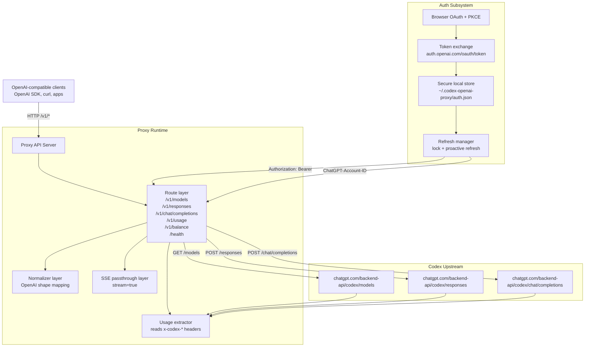
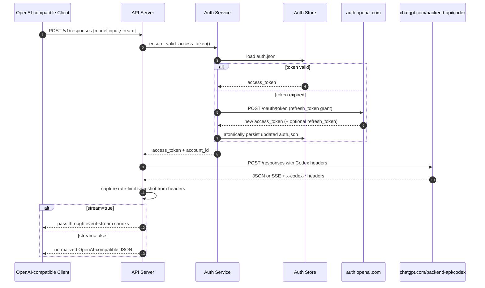
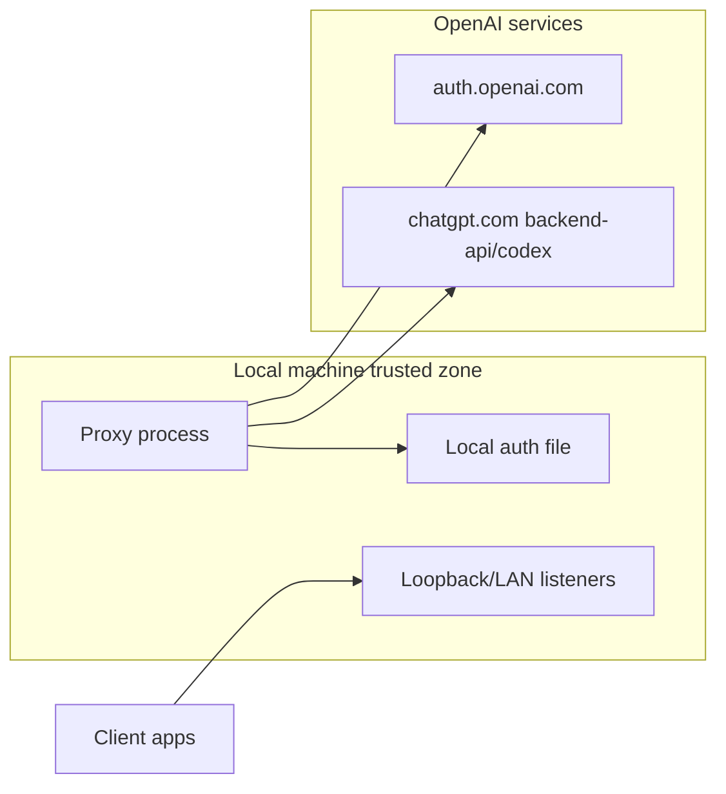

# System Architecture

This document describes the runtime architecture of `codex-openai-proxy` in a way that is portable to any language stack.

## High-Level Component Diagram

## Detailed Request Lifecycle

## Trust Boundaries

## Headers and Contracts

- Required upstream auth headers: `Authorization: Bearer <access_token>`.
- Workspace scoping header: `ChatGPT-Account-ID` when available.
- Compatibility header: `Openai-Beta: responses=experimental`.
- Codex identity headers: `User-Agent`, `Version`, and `Originator` semantics inherited from Codex conventions.
- Usage telemetry source: `x-codex-*` response headers, cached by the proxy for `/v1/usage` and `/v1/balance`.

## Failure Modes

- `401/403` from upstream: force token refresh once, then retry one time.
- malformed upstream body: return structured proxy error payload.
- missing local auth: return `401` with setup instructions and surface unauthenticated state in `/` page and `/health`.
- OAuth callback issues: browser flow can be bypassed with `setup-non-interactive` import mode.
